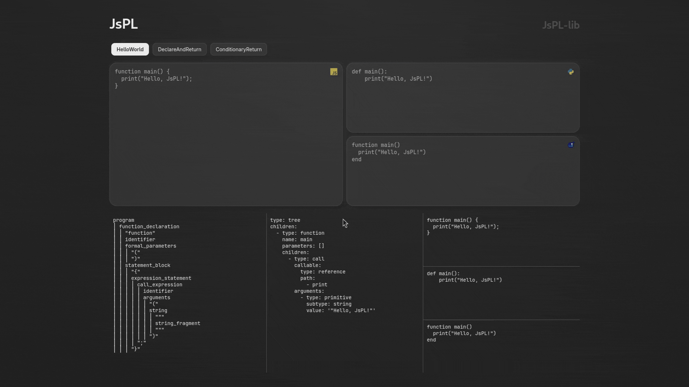

  <h1>JsPL</h1>
  
  
JavaScript-Python-Lua transpiler.

  

JsPL is a JavaScript-Python-Lua 3-way transpiler made using Tree-sitter, a powerful parser generator
tool that enables accurate syntax tree construction for code analysis and transformation. This
project aims to facilitate seamless code conversion between these three popular programming
languages by leveraging Tree-sitter's robust grammars to parse, analyze, and generate equivalent
syntax across language boundaries. By creating a unified intermediate representation and
implementing precise code generation rules, this transpiler will help developers prototype across
ecosystems or explore polyglot programming with greater ease.

Project consist of 2 (two) packages: `jspl` and `jspl-website`. `jspl` is the core transpiler
package which hosts the common AST and related tests and in the future it will include a CLI
runnable to be used on the command line. `jspl-website` is the website of the project built with
SvelteKit and is for introduction and documentation of the project as well as an online editor. See
`README.md` files in these subdirectories for development instructions.
